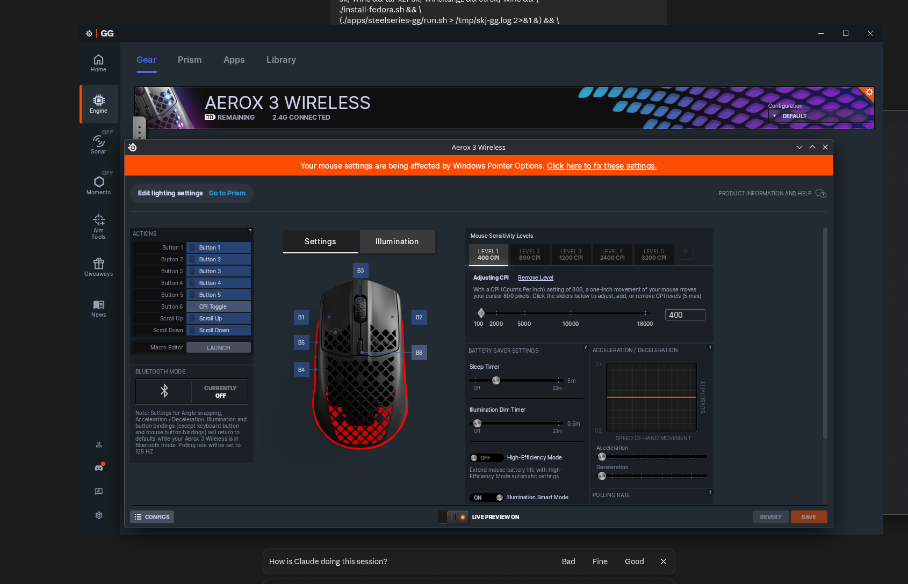

# SKJ Wine

A Wine build that isn't for games. It's for the **Windows apps that come with your hardware**
and other Windows-only software: SteelSeries GG, Corsair iCUE, and later Adobe apps and older
tools. Think "Proton GE, but for apps": one Wine with every fix, service and driver stand-in
those apps need on Linux.

Base: **Proton-GE** (GloriousEggroll's Proton build: Valve's Wine with DXVK, vkd3d-proton, NVIDIA
helpers and codecs; currently GE-Proton11-7) + the patches in `patches/wine/`, plus per-app setup
scripts that do what the Windows installers can't do under Wine.



## Status

| App | State |
|---|---|
| **SteelSeries GG** | **Works on real hardware** (Aerox 3 Wireless, Fedora 44): device detected, DPI, RGB/illumination, polling rate, sleep timer, button remaps (once saved), key remaps, battery, GPU-accelerated window (DXVK). Prism lighting (effects, presets), GameSense (Proton prefixes, CS2/Dota 2 config; checked with CS2) work. Prism's audio visualizer stays plain white with a mouse as the only Prism device (GG only samples audio when a per-key keyboard is connected). Aim Tools opens and installs the 3D Aim Trainer (drills not checked yet). Not yet: macros, 3D aim trainer, Moments, Sonar. Details: [`apps/steelseries-gg/NOTES.md`](apps/steelseries-gg/NOTES.md) |
| Corsair iCUE | Not started |
| Winamp (old app test) | Planned |
| Adobe | Long term |

---

## Install

No packages and no root: SKJ Wine lives in its own folder and in your home.

```bash
git clone https://github.com/jakub362/skj-wine.git && cd skj-wine && ./install.sh
```

- downloads **Proton-GE** (the release SKJ's fixes are built for, ~560 MB) into `./dist` and puts SKJ's fixed files on top; your normal Wine and Steam's Proton are never changed
- adds the commands `skj-wine` (the window), `skj-gg`, `skj-run` to `~/.local/bin` and "SKJ Wine" + "SteelSeries GG" to the app menu
- needs `python3-pyside6 curl sqlite openssl cabextract icoutils` (it tells you what is missing; on Fedora `sudo dnf install …`)

Then open **SKJ Wine** from the app menu:

- **Apps** — SteelSeries GG (Install / Open / Quit, start at login) and *Your Windows programs*: "Add a program…" takes any `.exe` or `.msi` and runs it in its own prefix
- **Experimental** — off-by-default switches (GG debug mode, with a daily log clean-up)
- **Wine** — what's installed, stop everything, and the one thing that needs your password: the rule that lets your user open SteelSeries devices

Update: `git pull && ./install.sh`. Remove: `./install.sh --remove` (programs and settings stay in `~/.local/share/skj-wine`).
Coming from the old RPM: run `./install.sh`, then `sudo dnf remove skj-wine`, then allow device access again on the *Wine* page.

## Using it

```
skj-gg                     open GG (first run: sets everything up)
skj-gg --auto              start GG in the background (what autostart uses)
skj-gg --stop              quit GG and its Wine processes
skj-gg --autostart on|off  start GG at login
skj-gg --setup             redo GG's setup in the existing prefix
skj-gg --gamesense         point games at GG again by hand (skj-gg does it on every start)
skj-gg --gamesense --remove  delete the GameSense files written into game folders
skj-gg --remove-data       delete GG's prefix (all GG settings) - asks first

skj-wine                   the window
skj-run NAME program.exe   run any Windows program in its own prefix NAME
skj-run NAME --winecfg | --kill | --path
```

In GG on first start: **I don't have a SteelSeries account → Skip this step for now →
Continue anyway** (or log in), then **Engine** to see your devices.

## Where things are

| What | Path |
|---|---|
| GG Wine prefix (all GG data/settings) | `~/.local/share/skj-wine/steelseries-gg/` (override: `SKJ_GG_PREFIX=…`) |
| GG install inside the prefix | `<prefix>/drive_c/Program Files/SteelSeries/GG/` |
| GG data (databases, logs, coreProps.json) | `<prefix>/drive_c/ProgramData/SteelSeries/GG/` |
| **GG log (all sub-apps)** | `<prefix>/drive_c/ProgramData/SteelSeries/GG/Logs/gg-errorlog.txt` |
| GG UI (Electron) log | `…/GG/Logs/nw-log.txt` |
| SKJ launcher logs | `~/.cache/skj-wine/gg.log`, `setup.log`, `wineboot.log` |
| Download cache | `~/.cache/skj-wine/` (GG installer, wine-mono, DXVK) |
| SKJ Wine's Wine | `./dist/bin/wine` in the skj-wine folder |
| Other programs' prefixes / logs | `~/.local/share/skj-wine/prefixes/NAME/`, `~/.cache/skj-wine/NAME.log` |
| Window's list of programs, switches | `~/.config/skj-wine/` |
| Autostart entry | `~/.config/autostart/skj-steelseries-gg.desktop` |
| GG icon (extracted from GG) | `~/.local/share/icons/hicolor/*/apps/skj-steelseries-gg.png` |

To run Wine commands in the GG prefix by hand:

```bash
export WINEPREFIX=~/.local/share/skj-wine/steelseries-gg PATH=~/path/to/skj-wine/dist/bin:$PATH
wine regedit            # registry
wine sc query skjsshid  # our driver service
wineserver -k           # kill everything in the prefix
```

## Troubleshooting

| Symptom | Cause / fix |
|---|---|
| GG doesn't open | `skj-gg --stop`, then `skj-gg`; read `~/.cache/skj-wine/gg.log` and `gg-errorlog.txt` |
| `wine: chdir to … No such file` / "GG install failed" | prefix parent folder missing (fixed in setup.sh); `mkdir -p ~/.local/share/skj-wine` and `skj-gg --setup` |
| Mouse not on the Engine/Gear page | device rule missing: SKJ Wine window → *Wine* → "Allow", replug the receiver, check `ls -l /dev/hidraw*` has your user in ACL (`getfacl`). `apps/steelseries-gg/check-mouse.sh` writes a full report |
| Orange "Windows Pointer Options" banner in GG | Wine's default mouse acceleration; setup.sh sets `HKCU\Control Panel\Mouse` MouseSpeed/MouseThreshold1/2 = 0 |
| GG window slow | DXVK missing: `tools/install-dxvk.sh` (`--undo` to remove). Check: `pgrep -af "SteelSeriesGGClient.*gpu-process"` must **not** contain `--disable-gpu` |
| Broken "SteelSeries GG" entry in the menu's **Wine** category | old winemenubuilder entry using the system Wine; `skj-gg` removes it on launch, or run `bin/skj-gg-icons` |
| Menu entry missing | `kbuildsycoca6 --noincremental`; search "SteelSeries" (it's under *Settings*) |
| Button remap sends both buttons | only in GG's *live preview*; press **Save** and the remap is written to the mouse |
| Changing polling rate disconnects the mouse | normal (same on Windows) |
| A game doesn't light up the mouse (GameSense) | start GG **before** the game (the port changes on every GG start). `cat ~/.cache/skj-wine/gamesense.log` shows where the address was written; run `skj-gg --gamesense` to redo it. Prefixes outside Steam/Heroic: `SKJ_GAMESENSE_PREFIXES=/path/to/prefix:/other skj-gg` |
| Audio Visualizer effect leaves the mouse plain white | GG limitation, not Wine: Prism only samples audio when a per-key SteelSeries keyboard is connected. Use another effect |
| A small Windows-style box says GG's update failed | GG found a newer version and its own updater can't run here. Close the box; the update is installed the next time GG starts (quit GG and open it again). The previous GG is kept in `~/.local/share/skj-wine/steelseries-gg.before-update` |
| Macros don't play | not implemented yet (`skj-inputd`, see roadmap) |
| Prism tab says "Device Not Found" / Prism effects don't reach the mouse | old `crypt32.dll` without patch 0005: update SKJ Wine (`git pull && ./install.sh`). Check: with `-enableDebugLog`, `gg-errorlog.txt` must not contain `device executor for device … not found` |
| A .NET program dies with `Cannot get symbol u_charsToUChars from libicuuc` | the prefix lacks the ICU libraries: `tools/prefix-prep.sh <prefix>` |
| GG doesn't see the mouse after changing Wine | Proton's Wine hides raw HID devices unless `PROTON_ENABLE_HIDRAW=1` is set (`skj-gg` sets it) |
| More Wine detail | run with `WINEDEBUG=err+all,warn+hid,warn+setupapi skj-gg`; driver log: `WINEDEBUG=+debugstr` shows `skjsshid:` lines |

## Layout

```
README.md                  this file
docs/DEVELOPMENT.md        how GG is put together, open work, gotchas
install.sh                 the installer (no root): ./dist Wine, commands, menu entries
bin/skj-wine               the window (Python, PySide6)
bin/skj-run                run any Windows program in its own prefix
bin/skj-gg                 GG launcher
bin/skj-gg-icons           GG icon extraction + winemenubuilder cleanup
bin/skj-gg-gamesense       copies GG's GameSense address into game prefixes, writes the CS2/Dota 2 GSI config
apps/steelseries-gg/       setup.sh (prefix + all fixes), run.sh, check-mouse.sh, NOTES.md, screenshots/
patches/wine/              Wine patches (each fixes a real Wine bug; upstreamable)
lib/BASE                   the Proton-GE release the files below were built against
lib/bin/wineserver         prebuilt patched wineserver (patch 0007)
lib/wine/x86_64-windows/   prebuilt patched DLLs (crypt32, secur32, mmdevapi, windows.storage.applicationdata)
drivers/skjsshid/          skjsshid.sys: WDM stand-in for SteelSeries' KMDF sshid.sys (\\.\SSengine)
tools/certinstall/         certinstall.exe: import a PFX into a Windows cert store (replaces PowerShell)
tools/chaintest/           chaintest.exe: print Wine's cert chain trust status
tools/sstest/              sstest.exe: talk to \\.\SSengine like GG does
tools/metertest/           metertest.exe: print the output device's peak meter and loopback level (checks patch 0006)
tools/prefix-prep.sh       copy the libraries that ship beside Wine (ICU; --gpu: DXVK, vkd3d-proton, nvapi) into a prefix
tools/install-dxvk.sh      DXVK 3.1.1 into a prefix (--undo)
tools/install-nvidia-libs.sh  NVENC/CUDA wrappers (nvidia-libs 1.0.2) into a prefix (--undo); needs the NVIDIA driver
bin/skj-screencast         gives Windows recorders the screen (desktop portal + PipeWire); started by skj-gg / skj-run
bin/skj-gg-hotkeys         GG's Alt+S (save a clip) as a desktop-wide key (portal GlobalShortcuts); started by skj-gg
bin/skj-icue               Corsair iCUE launcher; apps/corsair-icue/setup.sh installs it through Corsair's package manager
tools/winlist              lists the windows open in a prefix and their text (reads error boxes without a screen)
libs/mfaacenc              AAC audio encoder for Media Foundation (Windows has one, Wine doesn't) -> lib/prefix/system32
libs/skjdxgi               dxgi.dll that adds DXGI desktop duplication in front of DXVK's -> lib/prefix/dxgi
tools/mfttest, duptest     small test programs for the two above
docs/re-tools/             reverse-engineering helper scripts (see its README)
share/applications/, icons/  desktop entries, icon
```

## Wine patches

| Patch | Fixes |
|---|---|
| `0002-windows.storage.applicationdata-no-package-identity` | `ApplicationData.Current` worked for unpackaged apps → `Microsoft.Data.Sqlite` crashed |
| `0004-secur32-machine-keyset-containers` | Schannel only looked for key containers in HKCU → TLS servers with LocalMachine certs dropped connections |
| `0005-crypt32-match-ip-address-alt-names` | SSL chain policy ignored `iPAddress` subjectAltName entries → `https://127.0.0.1` with a localhost cert gave `CERT_E_CN_NO_MATCH`; GGEZ's event proxy to the GG core never connected, so Prism never lit a device |
| `0006-mmdevapi-audio-meter-information` | `IAudioMeterInformation` (endpoint peak meter) didn't exist → Prism's audio visualizer never sampled audio |
| `0007-server-named-pipe-without-io-access-starts-disconnected` | wineserver let clients connect to a pipe instance opened without read/write access (Go's go-winio uses one only to hold the name) → the first client hung. GG Moments never got its capture service's handshake |
| `0008-wtsapi32-open-local-server` | `WTSOpenServer` for the local machine returned NULL → programs that check their session first decide it isn't a local one. Corsair iCUE kept all its device scanning switched off |
| `0009-cfgmgr32-devnode-status-and-instance-notifications` | `CM_Get_DevNode_Status` succeeded without filling in an answer; per-device `CM_Register_Notification` failed. Both used by device-scanning code (Corsair iCUE) |
| `0010-setupapi-enumerator-name-property` | `SetupDiGetDeviceRegistryProperty(SPDRP_ENUMERATOR_NAME)` failed. Corsair iCUE asks it for every HID device and drops the device without it: empty device list |
| `0011-hidclass-indexed-strings-from-registry` | `HidD_GetIndexedString` was not supported. iCUE reads its protocol variant from USB string 5. Strings come from `tools/usb-strings.py` (usbfs → registry), since hidraw can't read them |

`patches/wine/already-in-proton/` holds two more (crypt32 NCRYPT flag, PFX key spec) that plain
wine-staging needed; Valve's Wine has its own versions.

## Building

### Patched DLLs and wineserver (only needed when changing a patch or moving to a new Proton-GE)

They must be built from exactly the source Proton-GE was built from, or wineserver and the DLLs
won't talk to the rest. What was done for GE-Proton11-7 (no root needed; mingw, autoconf and its
Perl modules can be unpacked from Fedora RPMs with `dnf download` + `rpm2cpio | cpio -idm`):

```bash
git clone --depth 1 --branch GE-Proton11-7 https://github.com/GloriousEggroll/proton-ge-custom.git ge && cd ge
git submodule update --init --depth 1 wine wine-staging
(cd wine && git fetch --depth 2 origin e813ca5771658b00875924ab88d525322e50d39f)   # a commit the recipe reverts
# run only the Wine part of GE's recipe (the "pushd wine … popd" block), without its autoreconf line:
{ sed -n 1,15p patches/protonprep-valve-staging.sh; sed -n '/^    pushd wine$/,/^    popd$/p' patches/protonprep-valve-staging.sh | grep -v 'autoreconf -f'; } > ../prep.sh && bash ../prep.sh
cd wine
dlls/winevulkan/make_vulkan -x vk.xml -X video.xml && tools/make_specfiles && autoconf -f && autoheader -f
for p in ../../skj-wine/patches/wine/*.patch; do git apply "$p"; done
mkdir ../../gebuild && cd ../../gebuild
../ge/wine/configure --enable-win64 --without-x --without-freetype --without-gstreamer --without-pulse \
  --without-alsa --without-cups --without-sane --without-v4l2 --without-gphoto --without-krb5 \
  --without-netapi --without-opencl --without-pcap --without-usb --without-vulkan --without-wayland \
  --without-dbus --without-gnutls --without-sdl --without-capi --without-oss --without-udev \
  --without-coreaudio --without-fontconfig
make -j$(nproc) server/wineserver dlls/crypt32/x86_64-windows/crypt32.dll dlls/secur32/x86_64-windows/secur32.dll \
  dlls/mmdevapi/x86_64-windows/mmdevapi.dll \
  dlls/windows.storage.applicationdata/x86_64-windows/windows.storage.applicationdata.dll
strip server/wineserver && cp server/wineserver ../skj-wine/lib/bin/
for d in crypt32 secur32 mmdevapi windows.storage.applicationdata; do
  x86_64-w64-mingw32-strip dlls/$d/x86_64-windows/$d.dll && cp dlls/$d/x86_64-windows/$d.dll ../skj-wine/lib/wine/x86_64-windows/
done
echo GE-Proton11-7 > ../skj-wine/lib/BASE     # and the new sha512 in install.sh
```

### Driver and tools (mingw)

```bash
# drivers/skjsshid
x86_64-w64-mingw32-gcc -O2 -Wall -I/usr/x86_64-w64-mingw32/sys-root/mingw/include/ddk \
  -shared -nostdlib -Wl,--subsystem,native -Wl,--entry,DriverEntry -Wl,--image-base,0x140000000 \
  -o skjsshid.sys skjsshid.c -lntoskrnl
# (Debian/Ubuntu ddk path: /usr/share/mingw-w64/include/ddk)
x86_64-w64-mingw32-gcc -O2 -o certinstall.exe certinstall.c -lcrypt32   # tools/certinstall
x86_64-w64-mingw32-gcc -O2 -o chaintest.exe   chaintest.c   -lcrypt32   # tools/chaintest
x86_64-w64-mingw32-gcc -O2 -o sstest.exe      sstest.c                  # tools/sstest
```

## Adding a new app (pattern from GG)

1. Install the app silently into a fresh prefix (`WINEDLLOVERRIDES=winemenubuilder.exe=d`).
2. Run each of its processes and read the logs; list what its installer failed to do
   (PowerShell, services, certificates, drivers, migrations) and redo it in `apps/<app>/setup.sh`.
3. Real Wine bugs → `patches/wine/` + rebuilt DLL in `lib/wine/`.
4. Kernel drivers it needs → WDM stand-in in `drivers/` (Wine can't load KMDF).
5. Launcher in `bin/`, desktop entry in `share/applications/`, a card in `bin/skj-wine`.

Part of SKJ Tech · skj-tech.online · GitHub: `jakub362/skj-wine`
