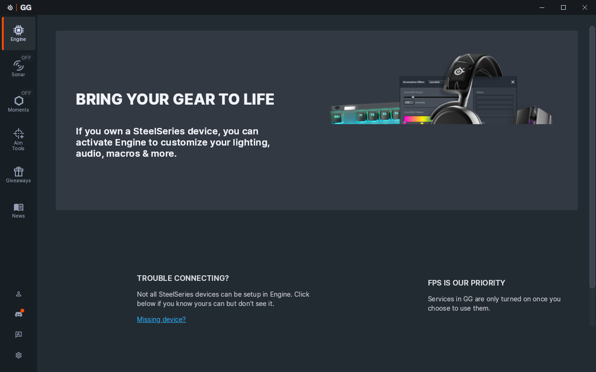

# SteelSeries GG under SKJ Wine — findings

Tested: GG 120.0.0, wine-staging 11.19 + SKJ patches 0001–0004, 2026-10-04.
`setup.sh` + `run.sh` verified end to end on a fresh prefix (about 2 min to set up).

## Status

| Piece | What it is | Status |
|---|---|---|
| `SteelSeriesGGEZ.exe` | .NET 8 ASP.NET Core server on `https://127.0.0.1:6327`, starts everything else | **Runs**, TLS with the real installed cert |
| `SteelSeriesGG.exe --hosted` ("oldGG") | Go, GG core | **Runs**, websocket to GGEZ connected |
| `apps/engine/SteelSeriesEngine.exe` | Go, device layer (`SSEdevice.dll` → `hid.dll` + `setupapi`) | **Runs**, serves `/devices`, `/quickset/items`, `/sock` |
| `apps/engine/prism/SteelSeriesPrism.exe` | RGB / lighting | **Runs** |
| `SteelSeriesMoments.exe` | Go, clip recorder | **Runs** |
| `SteelSeriesGGClient.exe` | Electron UI | **Runs**: login → skip → main app → Engine page. The login screen's left hero video stays blank (artwork on other screens is fine) |
| Update service proxy | .NET Framework Windows service | Not used (crashes on wine-mono; GGEZ is started directly) |
| `sshid.sys` | KMDF input filter → `\\.\SSengine` | **Replaced by `drivers/skjsshid`** (WDM, loads in Wine). Engine connects and enables it. Handles GG's *software* features only (macros, remaps, accel/decel, angle snapping), which are not emulated yet; DPI/RGB/polling go over HID |
| `ssdevfactory.sys`, `msihid.sys`, … | other KMDF drivers (virtual devices, MSI boards, PS/2, SMBus) | Can't load, disabled by setup.sh; not needed for mice |

## Problems found and fixes

1. **Installer can't run PowerShell** → no localhost TLS cert. `setup.sh` makes it with openssl, `tools/certinstall` imports it.
2. **`dbconf.yml` missing** in `GG\db` and `GG\apps\engine\db` → GG/Engine panic. Copied by `setup.sh`.
3. **Wine: `CryptAcquireCertificatePrivateKey` ignored `CRYPT_ACQUIRE_ONLY_NCRYPT_KEY_FLAG`** → .NET AccessViolation. `patches/wine/0001`.
4. **Wine: `ApplicationData.Current` succeeded for desktop apps** → `Microsoft.Data.Sqlite` crash. `patches/wine/0002`.
5. **Wine: `PFXImportCertStore` stored the wrong key spec (PP_KEYSPEC bitmask) and dropped `CRYPT_MACHINE_KEYSET`** → NTE_BAD_KEYSET / NTE_NO_KEY when opening the cert's key. `patches/wine/0003`.
6. **Wine: Schannel only looked for key containers in HKCU** → TLS server with a LocalMachine cert dropped every connection. `patches/wine/0004`.
7. **GGEZ didn't know about the Engine.** GGEZ starts sub-apps from its own `ggez.db`; the installer's table migration that should copy `engine`/`sonar`/`threeDAT` from `database.db` doesn't run under Wine. `setup.sh` copies the rows.
8. **`shared/guid.json` missing** → written by `setup.sh`.

## Known leftovers

- Some `tls: unknown certificate` lines from Engine/Moments while the UI starts. The requests then succeed (UI loads devices). Probably the UI connecting before it has received the sub-app's cert. Low priority.
- Login screen hero video doesn't play (likely a codec Wine/Electron lacks here).
- `chaintest.exe` (tools/) confirmed Wine's chain engine reports only `CERT_TRUST_IS_UNTRUSTED_ROOT` for GG's self-signed certs, which is what GGEZ expects.

## Next steps

- [ ] **Real Aerox 3 on Fedora**: enable hidraw (`DisableHidraw=0` under `HKLM\System\CurrentControlSet\Services\winebus`) + udev rule for `1038:*`, check the Engine page lists the mouse.
- [x] `sshid.sys` reverse engineered and replaced by `drivers/skjsshid` (see its README)
- [ ] Optional: implement macro playback / remap / accel via evdev+uinput in skjsshid
- [ ] Package SKJ Wine (patched wine-staging) for Fedora.
